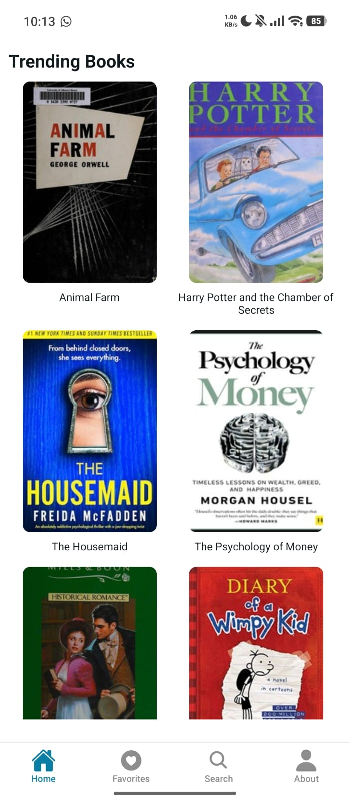
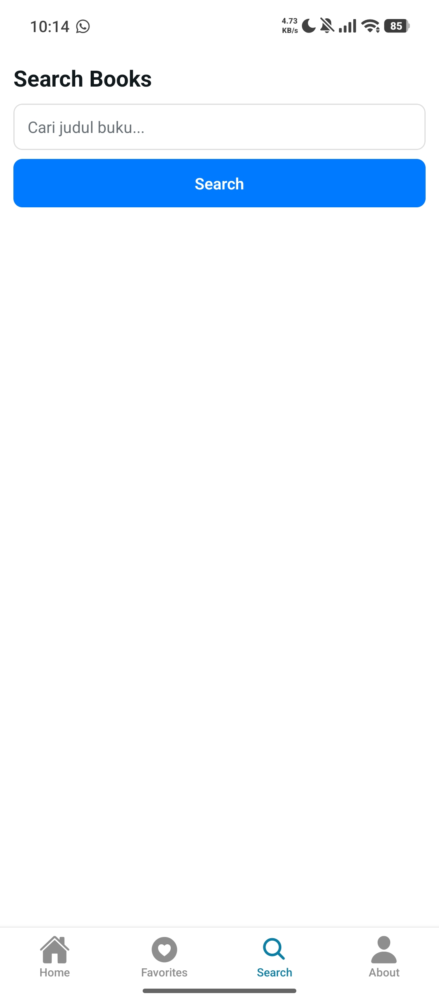
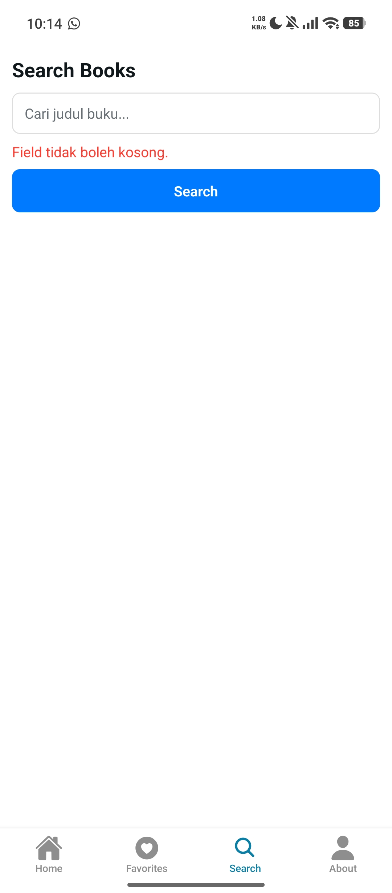
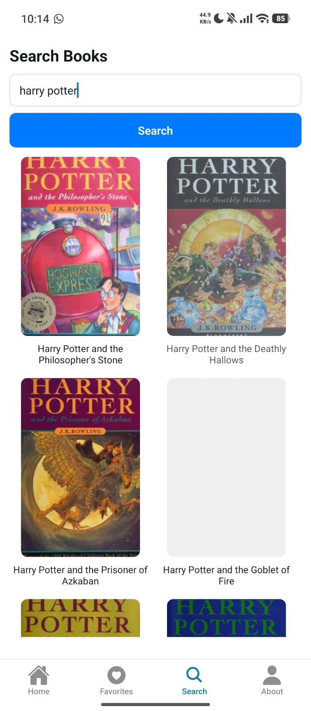
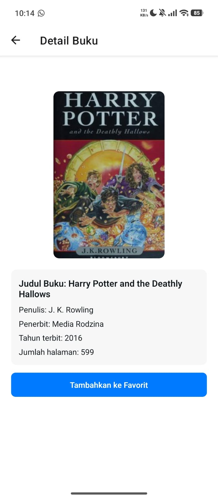
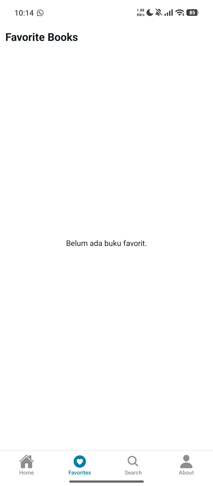
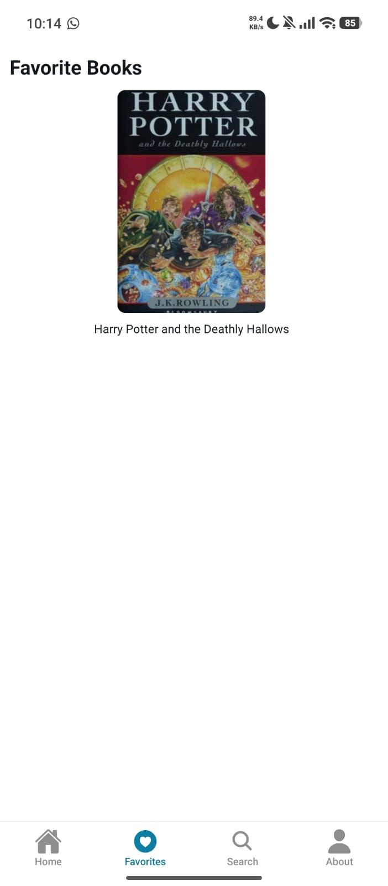
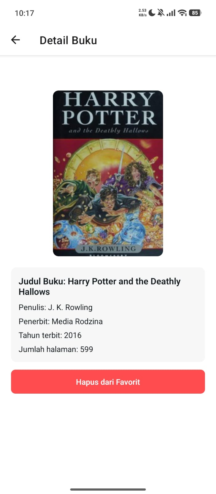
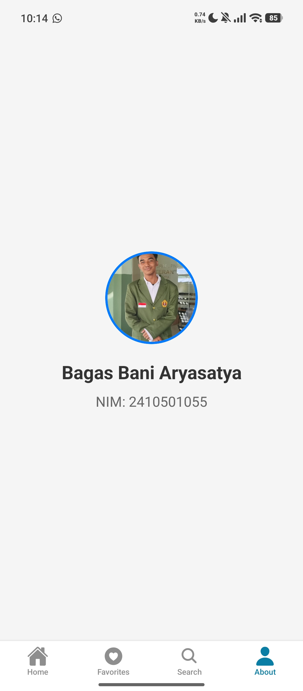

# Project UTS Pemrograman Mobile Lanjut

## Dibuat Oleh
- Nama: Bagas Bani Aryasatya
- NIM: 2410501055

## Tema
Tema yang dipilih adalah **Tema C (BookShelf)**.

## Tech Stack + Versi
- Node.js `v24.14.1`
- Expo `54.0.33`
- Expo Router `6.0.23`
- React `19.1.0`
- React Native `0.81.5`
- TypeScript `5.9.2`
- Zustand `5.0.12`

## Cara Install dan Menjalankan
1. Clone repository
   ```bash
   git clone https://github.com/Avlyxa1/uts-mobile-lanjut-24105010555-Bagas-Bani-Aryasatya/tree/master

   cd BookShelf
   ```
2. Install dependencies
   ```bash
   npm install
   ```
3. Jalankan project
   ```bash
   npx expo start
   ```

## Screenshot Aplikasi (9 Screen)
- `screenshots/screen-home.png`
- `screenshots/screen-search-def.png`
- `screenshots/screen-search-val.png`
- `screenshots/search-screen-success.png`
- `screenshots/screen-detail.png`
- `screenshots/screen-favorite-nf.png`
- `screenshots/screen-favorite-fav.png`
- `screenshots/screen-favorit-detail.png`
- `screenshots/screen-about.png`

### Home Screen


### Search Screen (Default)


### Search Screen (With Query)


### Search Screen (Success Result)


### Detail Screen


### Favorites Screen (Kosong)


### Favorites Screen (Ada Data)


### Favorite Detail Screen


### About Screen


## Link Video Demo
Isi link video demo di bawah ini:

- [Link Google Drive](https://drive.google.com/file/d/1Ivhs7XrD1cS2zypHmQf-AY2t1Z4Geg_M/view?usp=sharing)

## Justifikasi State Management
Project ini menggunakan **Zustand** karena API-nya sederhana, ringan, dan tidak memerlukan banyak boilerplate dibandingkan pendekatan global state lain. Zustand juga membantu memisahkan logic state dari komponen UI sehingga struktur kode lebih mudah dirawat ketika fitur bertambah. Selain itu, penggunaannya dengan React Native cukup mudah tanpa konfigurasi kompleks.

## Referensi
- [Dokumentasi Expo](https://docs.expo.dev/)
- [Dokumentasi Expo Router](https://docs.expo.dev/router/introduction/)
- [Dokumentasi React Native](https://reactnative.dev/docs/getting-started)
- [Dokumentasi TypeScript](https://www.typescriptlang.org/docs/)
- [Bottom Tab Navigator](https://reactnavigation.org/docs/bottom-tab-navigator/)
- [Dokumentasi React](https://react.dev/)
- [Dokumentasi tsconfig](https://www.typescriptlang.org/tsconfig/#paths)
- [Import Icon Tombol](https://oneuptime.com/blog/post/2026-01-15-react-native-path-aliases/view?utm_source=chatgpt.com)
- [Dokumentasi Zustand](https://docs.pmnd.rs/zustand/getting-started/introduction)
- [Referensi Array](https://developer.mozilla.org/en-US/docs/Web/JavaScript/Reference/Global_Objects/Array)
- [Referensi Math](https://developer.mozilla.org/en-US/docs/Web/JavaScript/Reference/Global_Objects/Array)
- [Context API](https://www.freecodecamp.org/news/react-context-api-explained-with-examples/)
- [API Open Library](https://openlibrary.org/developers/api)
- [Dokumentasi Search API](https://openlibrary.org/dev/docs/api/search)
- [Blog pengembangan React Native](https://www.notjust.dev/blog/2022-11-18-build-a-books-app)
- [Video tutorial React Native/Expo](https://www.youtube.com/watch?v=H8qOotIAaEA)

## Refleksi
Dengan adanya project ini, saya mendapatkan banyak pengalaman dan wawasan baru. Selama proses pengerjaan, saya mulai lebih memahami cara kerja React dan React Native, terutama dalam membuat komponen/metode yang bisa digunakan berulang kali sehingga proses pengembangan terasa lebih efisien dan terstruktur. Saya juga semakin memahami cara agar perpindahan antar screen berjalan lebih konsisten dan lancar. Selain itu, saya belajar bagaimana menyusun struktur kode yang lebih rapi agar aplikasi tetap mudah dikelola ketika fitur terus berkembang.

Saya juga belajar pentingnya pengelolaan data agar tetap konsisten di seluruh aplikasi. Zustand digunakan untuk mengatur state global sehingga data dapat diakses dan diperbarui oleh beberapa screen dengan lebih mudah. TypeScript sendiri sudah pernah saya gunakan sebelumnya, namun melalui project ini saya menjadi lebih memahami tentang bahasa pemrograman tersebut mulai dari penerapan tipe data, pembuatan user interface (UI), dan cara penulisan kode yang lebih terstruktur sehingga potensi kesalahan dapat dikurangi. Selain itu, melalui project ini saya menjadi lebih paham dalam proses pemanggilan API melalui fetch data, pengolahan response, serta menampilkan data secara dinamis sesuai kebutuhan aplikasi.

Secara keseluruhan, project ini memberikan pemahaman dan pengalaman yang lebih luas mengenai proses pengembangan aplikasi mobile, meningkatkan kemampuan teknis, serta menambahkan pengalaman saya untuk mengembangkan aplikasi yang lebih baik ke depannya.
